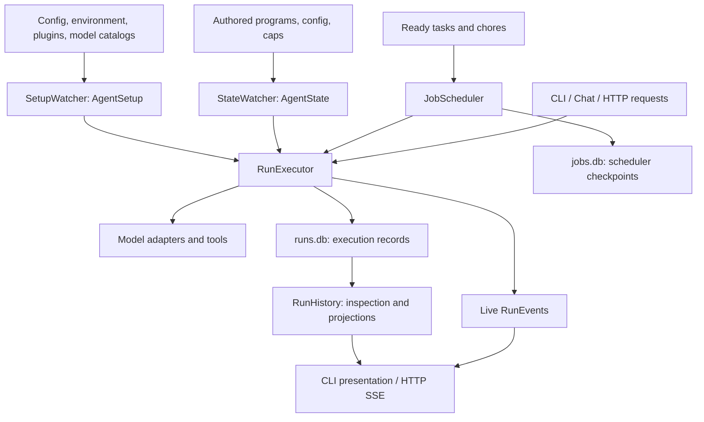

# Architecture

Verified against `origin/main` at `961b2d38` on 2026-10-04 (package version
0.3.6). This is the system model for Toolang maintainers and contributors. Follow the source and test links for details; consult a plan
for design history only after checking whether its behavior was implemented.

## Architecture at a glance

Toolang combines a `.too` language, an agent execution engine, durable history,
and CLI/HTTP entry points. Python 3.11+, macOS, and Linux are supported.
`too` is an alias for `toolang`.

The arrows show data flow, not the complete Python import graph. `AgentCore`
assembles the watchers, ID issuer, execution store, executor, history, and thread
manager. Hosting adds the HTTP application, scheduler, and watcher lifecycles.

| Package | Owns | Start reading |
| --- | --- | --- |
| `lang` | Grammar-backed AST, validation, formatting, typed call input | [ast.py](../src/toolang/lang/ast.py), [input.py](../src/toolang/lang/input.py) |
| `base`, `common` | Plugin protocols/value contracts; shared paths, IDs, config and helpers | [protocols/](../src/toolang/base/protocols/), [layout.py](../src/toolang/common/layout.py) |
| `catalog` | CRUD over authored agents, caps and job files | [manager.py](../src/toolang/catalog/manager.py) |
| `setup` | Installed resources, model readiness/routes, captured environment and defaults | [types.py](../src/toolang/setup/types.py), [watcher.py](../src/toolang/setup/watcher.py) |
| `state` | Immutable prepared programs, caps, workspace declarations and source revisions | [state.py](../src/toolang/state/state.py), [watcher.py](../src/toolang/state/watcher.py) |
| `work` | Ready job definitions, scheduling, claims and recovery | [scheduler.py](../src/toolang/work/scheduler.py), [store.py](../src/toolang/work/store.py) |
| `execution` | Run acceptance, execution, controls, persistence, history and inspection | [executor.py](../src/toolang/execution/executor/executor.py), [records.py](../src/toolang/execution/records.py) |
| `plugin` | Concrete tools, model catalogs/adapters, channels and sandboxes | [loading.py](../src/toolang/plugin/loading.py), [registrations](../pyproject.toml) |
| `up` | Process composition, server and sandbox lifecycle | [core.py](../src/toolang/up/core.py), [server.py](../src/toolang/up/server.py) |
| `api`, `cli` | HTTP schemas/routes; command routing, input and terminal presentation | [router.py](../src/toolang/api/router.py), [routing.py](../src/toolang/cli/toolang/routing.py) |

Parsing belongs to `lang`; runtime execution belongs to `execution`; environment
and CLI defaults are resolved at composition/call boundaries. Schemas consume
data rather than importing runtime services. Exact enforced import restrictions
are in [package boundary tests](../tests/architecture/test_package_boundaries.py);
some package-wide rules are still explicitly pending review.

## Vocabulary and ownership

| Concept | Current meaning |
| --- | --- |
| Agent | A materialized program and its owned caps, work definitions, state and runtime storage. |
| Placement | `resident`: managed agent home; `visiting`: remote source in a stable temporary root; `roaming`: local `.too` source using sibling `.toolang/`. |
| Sandbox | Where the server process runs: built-in `host` or `docker`. Independent of source placement. |
| Program / module | A parsed `Program`; State names and sources it as a module. `agent.too` is `agent`; direct `flows/<name>.too` files contribute separate modules. |
| Runnable | An `agic` model/tool loop or a `flow` of authored statements. Both share signature rules and public-name uniqueness. Unnamed entries are bound by State without rewriting AST names. |
| Cap | Reusable `psyche`, `skill`, `service` or `prompt` definition. Scopes overlay `root < home < here`; `here` belongs to one module. Forms are `authored`, `configured`, `inline`, `referenced`. |
| AgentSetup | One immutable setup generation with independently lazy, memoized model/provider/tool views and plugin families. |
| AgentState | One immutable composition of root/home revisions, programs, effective caps, workspaces and source provenance. Independent Markdown jobs are outside State. |
| Job | Authored `task` or RRULE `chore`. One stable job ID yields one thread, `<kind>_<id>`, across attempts. |
| Thread / Run / Step | Thread groups related runs; Run is one accepted invocation; Step records an execution unit within it. Child Runs point to their triggering Step. |
| Control | Durable run/thread transition or request, including run, retry, execute, steer, cancel, cwd, recall, compact, create, fork and rewind. Rerun creates a new run entry. |
| CallInput | Flat immutable mapping: `_` is primary input; other keys are named arguments. Omission differs from an empty supplied value. |
| Local / Output | Durable `Local` holds a typed value/reference and `dim`; `Output` adds its destination binding. The executor has a separate internal Local carrying flow shape and provenance. |
| Message / Part | Ordered canonical model content. Parts include text, reasoning, image, audio, document, tool call and tool result, subject to role restrictions. |

For durable Locals, `dim=0` means one complete value, including an array-valued
item; `dim=1` means a collection to iterate. Internal execution shape is
`none | item | list`. Array type and flow collection dimension are separate.
`_` is the primary local; `let name = ...` binds a named result; an unbound
result does not replace `_`. See [record shapes](run-step-records.md) and
[value contract tests](../tests/unit/execution/test_values.py).

## Acceptance, execution and change visibility

1. CLI resolves placement, configuration, workspaces and execution transport.
   Authored input and policy become a `RunRequest`, then a concrete `RunSpec`
   with setup/state, thread, bindings, limits and typed input.
2. `RunExecutor.run()` validates and commits the Run and entry Control before
   launching its owner task. The returned handle awaits its terminal result.
3. Agics assemble model history/instructions, invoke a model adapter, execute
   tool calls and coerce the final output. Flows dispatch statement handlers;
   child invocations create Runs, while `exec` replaces the current runnable
   within the same Run and retains its original output contract.
4. Steps persist inputs, outputs, State references and typed begin/end facts.
   Model inputs are reconstructable from content-addressed records. Live
   events feed presentation; history is reconstructed from records.
5. `RunHistory` supports inspection without a running server. Thread fork and
   rewind change logical history; acceptance order determines boundaries.

Accepted code, types and directives stay bound to their State revision. Resource
selectors evaluate the latest State at model-call boundaries, within the active
authority ceilings. A later **named** invocation resolves against the latest valid State, provided its identity and
signature remain compatible with the accepted caller. Inline/generated bodies
retain their containing code. Setup remains captured for the root execution;
workspace grants survive child acceptance and same-Run replacement. Watchers
keep the last valid publication when a candidate fails.

`retry` reopens a terminal root Run at a valid durable boundary, retaining its
identity and accepted entry; `rerun` starts a new root from the invocation.
Neither means automatic resumption after process death. A live stream has no
event replay cursor; reconnecting readers inspect durable state. See
[execution](execution.md), and
[binding scenarios](../tests/integration/execution/test_latest_state_binding.py).

## Resource selection and model/tool boundaries

- Root/home allow policy publishes effective resources; session/request
  ceilings narrow them. Runnable selectors operate within the allowed base:
  `+=` unions, `-=` removes, and `=` intersects. Queries cannot grant resources
  outside that base. Models, tools and caps use native TQ queries; runnable
  references are exact language references.
- `default` selects model/runnable bindings. `limit` bounds model/tool calls
  per agic and tokens, cost and time across the recursive root run tree.
  Model parameters are a separate request concern.
- Catalog plugins provide records; setup resolves readiness and routes;
  adapters execute protocols. Built-ins are `models_dev`, `ollama`, `llama_cpp`
  catalogs and `chat_completions`, `responses`, `messages`, `generate_content`
  adapters. Providers are catalog records, not another plugin family.
- Toolsets expose leaf tools with definitions and invocation methods. Core
  owns execution records, cancellation and runtime authority. Public built-ins
  cover files, shell, web, service integration and history; `me` manages agent
  source. Internal `_toolang` operations cover run/exec, guidance, working
  directory, rule recall and compaction. Not every internal operation is
  offered to the model.
- Named workspaces and `name://path` locations govern path resolution. The
  implicit workspace is `lab`. Attachments supply content without granting
  workspace access. Workspace checks are not an OS sandbox for arbitrary shell
  commands; server sandbox selection is a separate boundary.

Details: [queries](queries.md), [models](models.md), [tools](tools.md),
[plugins](plugins.md). Implementation: [resource resolution](../src/toolang/execution/executor/resources.py),
[policy](../src/toolang/execution/policy.py),
[runtime tools](../src/toolang/execution/tools/_toolang.py).

## Entry points and implementation boundaries

CLI, HTTP, Chat and scheduled jobs converge on the execution contracts above.
CLI/server acquisition chooses a compatible hosted runtime, embedded host
execution, or a command-owned temporary server. `RunClient` separates local
and remote run transport; closing a client releases its resources without
stopping an independently hosted server.

`ask` and `seek` parse and create execution steps, but their bridges currently
raise an error. The registered Telegram channel plugin is not started by server
assembly, and the HTTP router registers no `/hook/*` routes. Syntax and plugin
availability alone do not imply a connected execution path.

Evidence: [ask](../src/toolang/execution/executor/stmts/ask.py),
[seek](../src/toolang/execution/executor/stmts/seek.py),
[server](../src/toolang/up/server.py), [router](../src/toolang/api/router.py).

## Storage and scheduling

| Data | Location / owner | Meaning |
| --- | --- | --- |
| Authored source | Root/home config and caps; `agent.too`, `flows/`, job Markdown | Editable definitions, managed by `catalog` |
| Prepared State | Root `.state/root/`; home `.state/home/` and `.state/agent/` | Immutable SHA-256 revisions and atomic current pointers |
| Execution truth | Home `.runtime/runs.db` | Threads, runs, steps, controls and content; current schema **50**, incompatible stores rejected unchanged |
| Scheduler checkpoint | Home `.runtime/jobs.db` | Readiness, active claims and RRULE cursor; actual attempt history remains in `runs.db` |
| Process control | Root `.sandbox/<agent>/state.json` | Authoritative sandbox workload reference; home `.runtime/status.json` only describes the runtime |

Resident homes are `${TOOLANG_ROOT}/agents/<agent>`; the default root is
`~/.toolang`. Visiting roots are stable `/tmp/toolang-<name>-<hash>/` paths.
Roaming generated data stays under the source directory's `.toolang/`.
Project configuration discovery is bounded by the nearest Git worktree;
workspace grants come from source-local TOML. See [layout](layout.md) and
[script projects](script-projects.md).

The scheduler watches ready `tasks/` and `chores/`, merges program jobs by ID,
and uses a dedicated scheduler thread/event loop. It submits Runs onto the
execution loop. Task body changes make a new revision pending; chore failure
does not disable later occurrences. Claims bridge two databases: recovery
releases claims with no accepted Run, reconciles terminal Runs, and blocks
interrupted accepted Runs rather than duplicating their execution.

The execution schema version is maintained in
[RunStore](../src/toolang/execution/store.py); compatibility behavior is covered
by [schema tests](../tests/unit/execution/test_store_schema.py). It is independent
of State layer schemas and the job checkpoint schema.

## Find evidence without rescanning

Read the relevant row, open its owner, then inspect its focused tests. These
are navigation anchors, not a claim that every test was run for this document.

| Question | Evidence to open next |
| --- | --- |
| Language, input or flow semantics | [lang tests](../tests/unit/lang/), [flow scenarios](../tests/integration/execution/test_flow_scenarios.py), [typed template regression](../tests/unit/execution/test_execution_template.py) |
| State publication or changed source | [State tests](../tests/unit/state/), [latest binding scenarios](../tests/integration/execution/test_latest_state_binding.py) |
| Setup readiness or lazy loading | [Setup tests](../tests/unit/setup/), [lazy setup integration](../tests/integration/setup/test_lazy_setup.py) |
| Scheduling and recovery | [scheduler tests](../tests/unit/work/test_scheduler.py), [scheduled runs](../tests/integration/execution/test_scheduled_runs.py) |
| Records, controls or history | [value tests](../tests/unit/execution/test_values.py), [control relations](../tests/integration/execution/test_control_relations.py), [inspection tests](../tests/unit/execution/test_inspection.py) |
| Local/remote CLI or HTTP behavior | [CLI integration](../tests/integration/cli/), [remote runs](../tests/integration/api/test_remote_runs.py) |
| Plugins or hosting | [plugin tests](../tests/unit/plugin/), [sandbox lifecycle](../tests/integration/up/test_sandbox_lifecycle.py) |

When updating this architecture guide, compare the recorded baseline to the desired
revision first (`git diff --name-only 961b2d38..HEAD -- src/toolang tests docs
pyproject.toml`). Recheck only affected owners and their consumers, update the
matching summary and baseline, then validate links and `git diff --check`.
Expand the search only when those paths leave an unanswered question.

Use [the documentation index](index.md) for detailed guides and design context.
`docs/plans/` and dated evaluations are historical evidence;
[CHANGELOG.md](../CHANGELOG.md) remains the user-facing change record.
